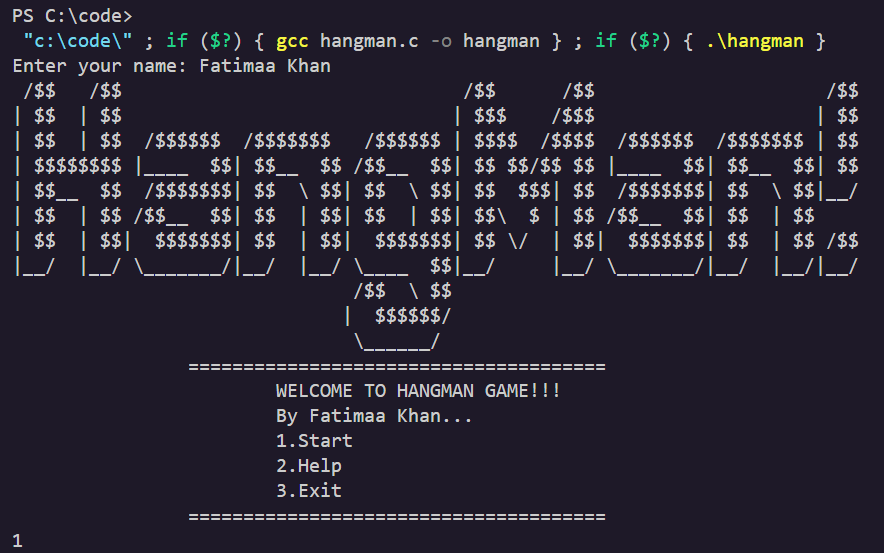

## Overview

Welcome to the Hangman Game! This is a simple command-line game where the player guesses letters to figure out a hidden word. The game was built using C and showcases fundamental programming concepts such as loops, conditionals, and functions.

## Table of Contents

- [Features](#features)
- [Usage](#usage)
- [Gameplay](#gameplay)
- [Contact](#contact)

## Features

- Simple and intuitive gameplay.
- Word bank with multiple difficulty levels.
- ASCII art for visual feedback.
- Tracks the player's progress and number of attempts.
- Supports single-player mode.

## Usage 
After launching the game, follow the on-screen instructions to start playing. 
The goal is to guess the hidden word by inputting one letter at a time. 
Be careful—too many wrong guesses will result in the hangman being completed, and you’ll lose the game!

## Gameplay
Start the game: The game will randomly select a word from the word bank.
Guess a letter: Input a letter to see if it’s in the word.
Win or lose: You win if you guess the word before the hangman is fully drawn. Otherwise, you lose, and the word is revealed.

## Contact
If you have any questions or feedback, feel free to reach out:
GitHub: fatimazherk
Email: fatimazherk@gmail.com

